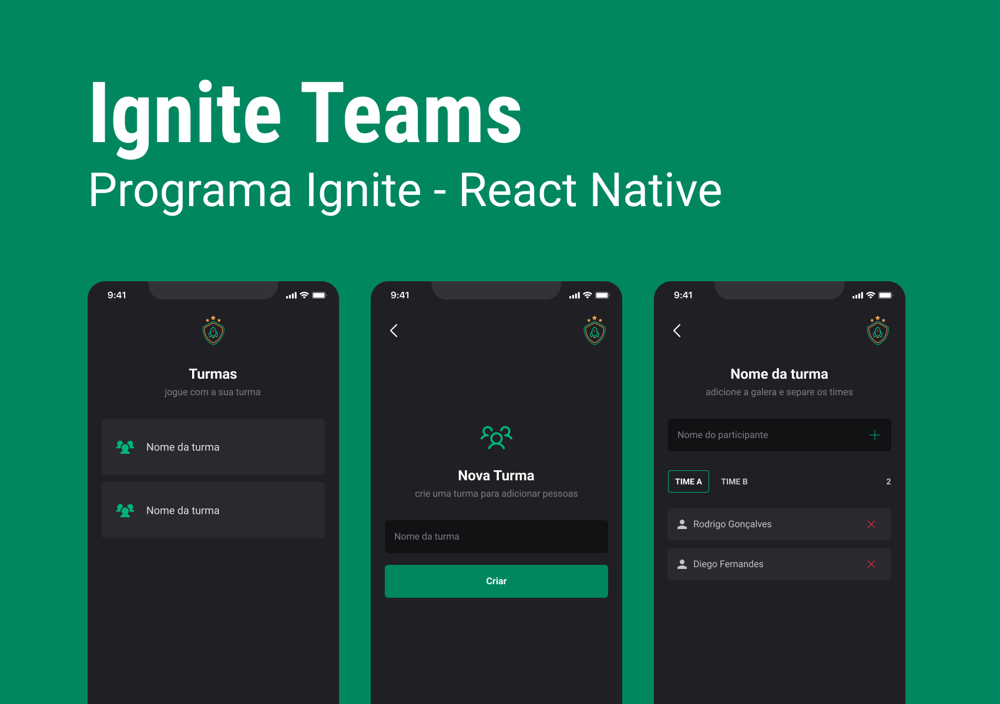

# Ignite Teams

Um aplicativo para gerenciamentos de equipes, feito utilizando as melhores práticas de desenvolvimento e UI/UX. Podendo ser utlizado para diversos propositos que tenha necessidade de criação e separação de equipes.


## Screenshots




## 🛠 Stack utilizada

- [React Native](https://reactnative.dev/)
- [Styled Components](https://styled-components.com/)
- [Typescript](https://www.typescriptlang.org/)
- [React Navigation](https://reactnavigation.org/)


## Funcionalidades

- Criação de times
- Criação de participante
- Edição de time
- Remoção de time e participante

## Clone o projeto

```bash
  git clone https://github.com/GabrielLopes001/teams
```

Entre no diretório do projeto

```bash
  cd teams
```

Instale as dependências

```bash
  npm install
```

Inicie o servidor

```bash
  npx expo start
```

## Licença

[MIT](https://choosealicense.com/licenses/mit/)
